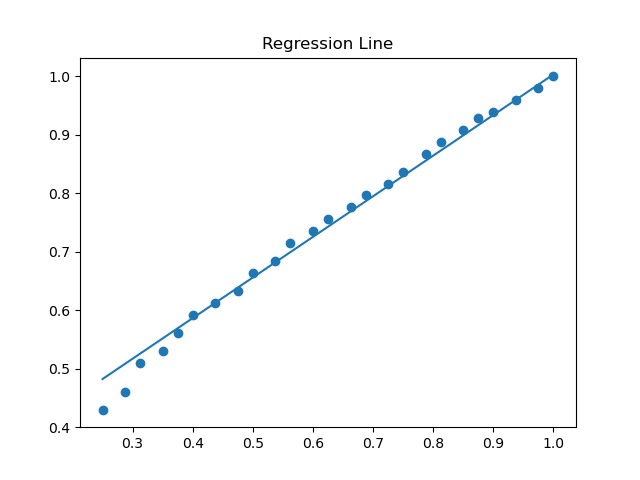
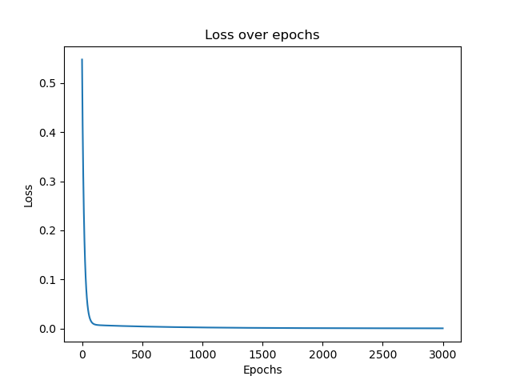
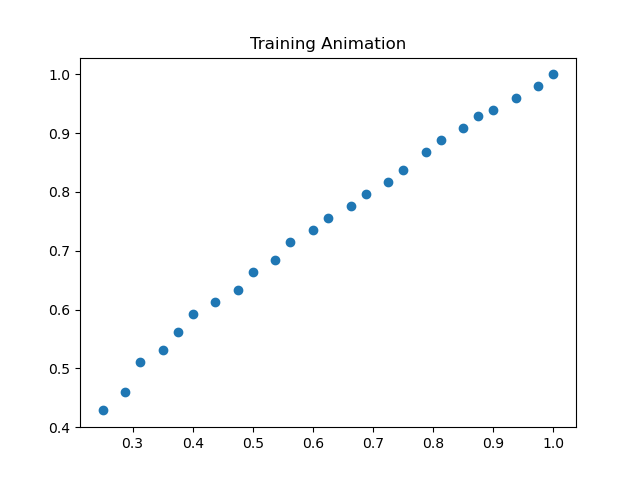

#  Linear Regression from Scratch

A simple Machine Learning project implementing **Linear Regression using Gradient Descent from scratch** (without ML libraries), with visualization and animation of the learning process.

---

##  Features

* Linear Regression implemented from scratch
* Gradient Descent optimization
* Loss tracking over epochs
* Data normalization
* Comparison with scikit-learn
* Visualization of regression line
* Animated training process (GIF)

---

##  How it Works

We model a linear relationship:

[
y = mx + b
]

* ( m ) → slope
* ( b ) → intercept

---

##  Loss Function (Mean Squared Error)

We measure error using MSE:

[
\text{MSE} = \frac{1}{n} \sum_{i=1}^{n} (y_i - (mx_i + b))^2
]

---

##  Gradient Descent (Parameter Updates)

We minimize the loss by computing partial derivatives.

### Partial derivative w.r.t ( m ):

[
\frac{\partial}{\partial m} = -\frac{2}{n} \sum x_i (y_i - (mx_i + b))
]

### Partial derivative w.r.t ( b ):

[
\frac{\partial}{\partial b} = -\frac{2}{n} \sum (y_i - (mx_i + b))
]

---

##  Update Rules

[
m = m - L \cdot \frac{\partial}{\partial m}
]

[
b = b - L \cdot \frac{\partial}{\partial b}
]

* ( L ) → learning rate

---

##  Results

### Regression Line



### Loss over Time



### Training Animation



---

##  Comparison with Scikit-Learn

Example output:

```
Built model:    y = 0.7341x + 0.2827
Sklearn model: y = 0.7392x + 0.2794
```

---

##  Installation

```bash
git clone https://github.com/Neeraj10687/ml-linear-regression-from-scratch.git
cd ml-linear-regression-from-scratch
pip install -r requirements.txt
```

---

##  Usage

### Basic run

```bash
python main.py
```

### With custom parameters

```bash
python main.py --epochs 5000 --lr 0.01
```

### With animation

```bash
python main.py --epochs 5000 --lr 0.01 --animate
```

---

##  Project Structure

```
ml-linear-regression/
│
├── data.csv
├── main.py
├── model.py
├── train.py
├── plot.py
├── compare.py
├── plots/
│   ├── regression.png
│   ├── loss.png
│   └── training.gif
└── README.md
```

---

##  Concepts Covered

* Linear Regression
* Mean Squared Error (MSE)
* Gradient Descent
* Learning Rate & Convergence
* Data Normalization

---

##  Purpose

This project is built to:

* Understand ML fundamentals deeply
* Implement algorithms without abstraction
* Visualize how models learn

---

##  Future Improvements

* Multiple Linear Regression
* Polynomial Regression
* CLI dataset input

---

##  Author

* Neeraj N

---


